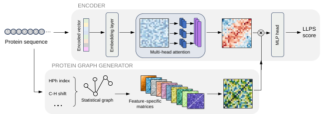

# Phaseek: LLPS Prediction and Phase-Separating Peptide Generation

[](https://colab.research.google.com/github/AMIRMOHAMMAD-OSS/Phaseek/blob/main/phaseek_colab.ipynb)
[](https://huggingface.co/AmirMMH/Phaseek)
[](https://www.biorxiv.org/content/10.1101/2025.01.27.635039v2)
[](LICENSE.pdf)

## Overview

Phaseek is a sequence-based computational tool for studying protein liquid–liquid phase separation (LLPS).

It provides two main capabilities:

1. **LLPS prediction**  
   Phaseek scores amino-acid sequences for their predicted propensity to undergo liquid–liquid phase separation and identifies residue-level regions associated with the prediction.

2. **Phase-separating peptide generation**  
   Phaseek designs de novo amino-acid sequences with high predicted LLPS propensity using a differentiable sequence-optimization method inspired by SeqProp.

Phaseek supports:

- Phaseek v1 and Phaseek v2
- single-sequence prediction
- batch prediction from FASTA files
- residue-level LLPS profiles
- long-sequence inference with overlapping windows
- gradient-based peptide generation
- optional local sequence refinement
- Google Colab execution

## Online Resources

- [Run Phaseek in Google Colab](https://colab.research.google.com/github/AMIRMOHAMMAD-OSS/Phaseek/blob/main/phaseek_colab.ipynb)
- [Phaseek model files on Hugging Face](https://huggingface.co/AmirMMH/Phaseek)
- [Phaseek preprint on bioRxiv](https://www.biorxiv.org/content/10.1101/2025.01.27.635039v2)

## Model Architecture



Phaseek combines contextual protein-sequence representations with protein graph features to predict LLPS propensity.

Phaseek v2 uses a Transformer-based sequence encoder together with FEGS graph matrices. It produces a raw sequence-level LLPS score, while the complete Phaseek prediction pipeline also provides a residue-level LLPS profile and a final combined score.

## Installation

Clone the repository:

```bash
git clone https://github.com/AMIRMOHAMMAD-OSS/Phaseek.git
cd Phaseek
```

Creating a virtual environment is recommended.

### Linux or macOS

```bash
python -m venv .venv
source .venv/bin/activate
```

### Windows

```bash
python -m venv .venv
.venv\Scripts\activate
```

Install the required packages:

```bash
pip install -r requirements.txt
```

## Required Model Files

Phaseek v1 uses the model files stored in the repository-level `model` directory.

For local Phaseek v2 inference, the trained checkpoint must be available at:

```text
Functions/Phaseek_v2/model/best.pt
```

The FEGS matrix file must be available at:

```text
Functions/M.mat
```

The Google Colab notebook configures and downloads the required files automatically.

## Prediction Usage

The main command-line interface is:

```text
Functions/runner.py
```

### Phaseek v2 single-sequence prediction

```bash
python Functions/runner.py \
  --model v2 \
  --sequence "MASNDYTQQATQSYGAYPTQPGQGYSQQSSQPYGQQSYSGYSQSTDTSGYGQSSYSSYGQSQNTGYGTQSTPQGYGSTGGYGSSQSSQSSYGQQSSYPGYGQQPAPSSTSGSYGSSSQSSSYGQPQSGSYSQQPSYGGQQQSYGQQQSYNPPQGYGQQNQYNSSSGGGGGGGGGGYGSGRGKGGKGLGGKGLGKGGAKRHRK" \
  --id test_sequence \
  --directory test_results \
  --device auto \
  --window-size 512 \
  --stride 256 \
  --aggregation mean
```

### Phaseek v1 single-sequence prediction

```bash
python Functions/runner.py \
  --model v1 \
  --sequence "MASNDYTQQATQSYGAYPTQPGQGYSQQSSQPYGQQSYSGYSQSTDTSGYGQSSYSSYGQSQ" \
  --id test_sequence_v1 \
  --directory test_results
```

### FASTA batch prediction

```bash
python Functions/runner.py \
  --model v2 \
  --fasta proteins.fasta \
  --id FASTA_results \
  --directory batch_results \
  --end-sequence 100 \
  --device auto \
  --window-size 512 \
  --stride 256 \
  --aggregation mean
```

The `--end-sequence` argument limits the number of records read from the FASTA file. It does not truncate individual protein sequences.

## Command-Line Arguments

| Argument | Description |
|---|---|
| `--model` | Selects `v1` or `v2`. |
| `--sequence` | Amino-acid sequence for single-sequence prediction. |
| `--fasta` | Path to a FASTA file for batch prediction. |
| `--id` | Identifier used for the result folder and output files. |
| `--directory` | Parent directory created inside `Functions/Results`. |
| `--end-sequence` | Maximum number of FASTA records to process. |
| `--device` | Selects `auto`, `cpu`, or `cuda`. |
| `--window-size` | Maximum Phaseek v2 inference-window length. |
| `--stride` | Number of residues between consecutive v2 windows. |
| `--aggregation` | Combines v2 window scores using `mean` or `max`. |
| `--checkpoint` | Optional custom path to the Phaseek v2 checkpoint. |
| `--m-mat` | Optional custom path to the FEGS `M.mat` file. |

## Long-Sequence Prediction

Phaseek v2 has a maximum model input length of 512 amino acids.

Sequences longer than the selected window size are divided into overlapping windows. The default settings are:

```text
Window size: 512
Stride: 256
Aggregation: mean
```

The final window is anchored to the end of the sequence so that the complete protein is represented.

The raw Phaseek v2 score is calculated by applying the selected aggregation method to the individual window scores:

- `mean`: average of all window scores
- `max`: maximum window score

## Phaseek Scores

For Phaseek v1, the pipeline calculates:

- a raw sequence-level v1 score
- a v1 residue-level LLPS profile
- a final combined Phaseek score

For Phaseek v2, the pipeline calculates:

- a raw sequence-level v2 score
- a v1 residue-level LLPS profile
- a final combined Phaseek score using the existing Phaseek scoring combination

The final score is reported in the range from 0 to 1.

The residue-level profile is generated by the Phaseek v1 residue-scoring procedure for both model selections.

## Output Files

Results are saved under:

```text
Functions/Results/<directory>/<sequence_id>/
```

### Single-sequence output

A single-sequence prediction may produce:

```text
scores.csv
prediction.json
window_scores.csv
```

### `scores.csv`

Contains the residue-level profile:

| Column | Description |
|---|---|
| `scores` | Residue-level LLPS score |
| `seq` | Amino-acid residue |

### `prediction.json`

Contains the prediction summary, including:

- sequence identifier
- sequence length
- selected model
- final Phaseek score
- final threshold
- predicted class
- raw model score
- raw model threshold
- raw v1 score
- residue-level model
- window aggregation method
- number of windows

### `window_scores.csv`

Created when Phaseek v2 window-level scores are available.

It contains:

| Column | Description |
|---|---|
| `window` | Window number |
| `start` | First residue position |
| `end` | Final residue position |
| `score` | Raw v2 score for the window |

### FASTA batch output

For FASTA batch prediction, the combined output is saved as:

```text
LLPS_prediction_of_seqs.csv
```

Individual sequence result directories are also created.

## Colab Workflow

The Phaseek Colab notebook provides an interactive workflow for:

1. installing Phaseek and its dependencies
2. selecting Phaseek v1 or v2
3. scoring a single sequence or FASTA file
4. plotting the residue-level LLPS profile
5. predicting or loading a protein structure
6. mapping residue-level LLPS scores onto the structure
7. generating phase-separating peptide candidates
8. downloading the result files

Open the notebook here:

[Run Phaseek in Google Colab](https://colab.research.google.com/github/AMIRMOHAMMAD-OSS/Phaseek/blob/main/phaseek_colab.ipynb)

## Phase-Separating Peptide Generation

Phaseek includes a gradient-based method for generating new amino-acid sequences with high predicted LLPS propensity.

The method is inspired by SeqProp and represents each candidate sequence as a trainable logit matrix:

\[
\theta \in \mathbb{R}^{L \times 20}
\]

where:

- \(L\) is the sequence length selected by the user
- 20 represents the standard amino-acid alphabet

The first sequence position is fixed to methionine. The remaining logit vectors are randomly initialized.

During optimization, the logits are converted into differentiable amino-acid probabilities using a temperature-controlled Gumbel relaxation:

\[
P_{i,a} =
\frac{
\exp\left((\theta_{i,a}+\alpha_tG_{i,a})/\tau_t\right)
}{
\sum_{b=1}^{20}
\exp\left((\theta_{i,b}+\alpha_tG_{i,b})/\tau_t\right)
}
\]

where:

- \(G_{i,a}\) is Gumbel noise
- \(\tau_t\) is the temperature at optimization step \(t\)
- \(\alpha_t\) controls the magnitude of the noise

The relaxed amino-acid probability matrix is projected into the model embedding space:

\[
E = P W_{AA}
\]

where \(W_{AA}\) is the frozen amino-acid embedding matrix of the selected Phaseek model.

The sequence parameters are optimized using:

\[
\mathcal{L}
=
-S_{\mathrm{LLPS}}
+
\lambda H(P)
\]

where:

- \(S_{\mathrm{LLPS}}\) is the differentiable LLPS score
- \(H(P)\) is the entropy of the amino-acid probability matrix
- \(\lambda\) controls entropy regularization

Only the sequence logits are optimized. The trained Phaseek model parameters remain frozen.

After optimization, the final peptide is obtained by selecting the amino acid with the highest optimized logit at each position:

\[
s_i =
\operatorname*{argmax}_{a}
\theta_{i,a}
\]

An optional local refinement step can test single-residue substitutions and retain changes that further increase the selected model’s raw LLPS score.

## Phaseek v1 Generation

When Phaseek v1 is selected, the relaxed amino-acid embeddings are passed through the frozen v1 Transformer classifier.

Gradients flow from the predicted LLPS score through the classifier and expected embeddings to the sequence logit matrix.

## Phaseek v2 Generation

When Phaseek v2 is selected, the relaxed amino-acid embeddings are passed through the v2 Transformer together with the FEGS graph matrices.

Because FEGS extraction operates on a discrete amino-acid sequence, the graph matrices are periodically reconstructed from the current argmax sequence.

The graph matrices are treated as fixed conditioning information between refresh steps. Gradients pass through the relaxed sequence-embedding branch but not through the FEGS extraction procedure.

After generation, every final sequence is rescored using the normal selected Phaseek prediction pipeline.

## Peptide-Generation Parameters

### `MODEL_VERSION`

Selects the Phaseek model used during generation:

```text
v1
v2
```

### `SEQUENCE_LENGTH`

Sets the number of amino acids in each generated peptide.

The selected value must not exceed the maximum input length supported by the model.

### `NUMBER_OF_SEQUENCES`

Sets the number of independent peptide-design runs.

Each run starts from a different random initialization.

### `RANDOM_SEED`

Controls the initial logit matrix and Gumbel noise.

When several peptides are generated, consecutive seeds are used. For example, with:

```text
RANDOM_SEED = 42
```

the first three runs use:

```text
42
43
44
```

### `GRADIENT_STEPS`

Sets the number of Adam optimization iterations.

During every iteration, Phaseek:

1. calculates relaxed amino-acid probabilities
2. produces expected amino-acid embeddings
3. calculates the differentiable LLPS score
4. calculates the entropy penalty
5. backpropagates the loss
6. updates the sequence logits

More steps may improve convergence but increase runtime.

### `LEARNING_RATE`

Sets the Adam optimizer step size.

A larger value updates the amino-acid logits more aggressively. A smaller value produces slower and more gradual optimization.

### `ENTROPY_WEIGHT`

Controls the contribution of entropy regularization:

\[
\mathcal{L}
=
-S_{\mathrm{LLPS}}
+
\lambda H(P)
\]

Increasing this value encourages sharper amino-acid probability distributions. Excessively large values may reduce exploration and produce premature convergence.

### `TEMP_START`

Sets the Gumbel-relaxation temperature at the first optimization step.

A higher initial temperature creates smoother amino-acid probability distributions and supports broader exploration.

### `TEMP_END`

Sets the temperature at the final optimization step.

The temperature is reduced linearly:

\[
\tau_t =
\tau_{\mathrm{start}}
+
\frac{t}{N-1}
\left(
\tau_{\mathrm{end}}
-
\tau_{\mathrm{start}}
\right)
\]

A low final temperature produces sharper distributions before argmax decoding.

### `GUMBEL_NOISE_START`

Sets the initial scale of the Gumbel noise.

The noise decreases linearly toward zero:

\[
\alpha_t =
\alpha_{\mathrm{start}}
\left(
1-\frac{t}{N-1}
\right)
\]

This supports stochastic exploration in the early iterations and increasingly deterministic optimization near the end.

### `V2_GRAPH_REFRESH`

Used only for Phaseek v2.

It controls how often the FEGS matrices are reconstructed from the current argmax sequence.

A smaller value keeps the graph representation more closely synchronized with the changing sequence but increases runtime.

A larger value improves speed but keeps the same graph matrices fixed for more optimization steps.

### `LOG_EVERY`

Controls how frequently progress information is displayed.

This setting changes only the notebook output and does not affect optimization.

### `ENABLE_REFINEMENT`

Enables the optional local hill-climbing stage after gradient optimization.

When enabled, Phaseek tests single-residue substitutions and retains substitutions that increase the selected model’s raw LLPS score.

The fixed N-terminal methionine is not modified.

### `REFINEMENT_PASSES`

Sets the maximum number of local-refinement rounds.

For a peptide of length \(L\), one complete pass may require up to:

\[
19(L-1)
\]

additional model evaluations.

Refinement stops early when a full pass produces no improving substitution.

## Generated Peptide Output

Generated peptide results are saved under:

```text
Functions/Results/Generated_peptides/
```

The output includes:

```text
generated_peptides.csv
generated_peptides.fasta
generation_settings.json
```

Each generated sequence also receives its own Phaseek result directory containing its score files.

## Repository Structure

A simplified view of the repository is shown below:

```text
Phaseek/
├── Functions/
│   ├── Phaseek_v1/
│   ├── Phaseek_v2/
│   ├── XG_Boost/
│   ├── phaseek_v2/
│   ├── FEGS_feature_extraction.py
│   ├── M.mat
│   ├── runner.py
│   └── Results/
├── model/
├── phaseek_colab.ipynb
├── Picture11.svg
├── LICENSE.pdf
├── README.md
└── requirements.txt
```

## Issues and Contributions

Bug reports and feature requests may be submitted through GitHub Issues.

Code contributions, modified versions and redistribution are governed by the Phaseek license.

Before distributing a Contribution or modified version, users must contact Inserm Transfert to determine whether and under which conditions it may be distributed.

## License

Phaseek v2.0 is distributed under the:

**Phaseek License – research purposes restricted**

The complete license is available in:

[LICENSE.pdf](LICENSE.pdf)

Phaseek v2.0 includes:

- source code
- object code
- trained models
- model weights
- user interfaces
- graphical interfaces
- related documentation

Use is permitted only for strictly academic and non-commercial research under the full terms of the license.

Uses that are not authorized under this research license include, among others:

- use in clinical trials
- diagnostic or therapeutic use
- fee-based research services
- projects or collaborative research with for-profit organizations
- use in a commercial product
- commercial or industrial product development
- commercial or industrial process development
- activities intended to obtain a commercial advantage or financial compensation

Any use outside the licensed scope requires a separate written agreement with Inserm Transfert.

Downloading or using Phaseek acknowledges acceptance of and compliance with the license conditions.

### Patent Notice

The peptide-generation method implemented in Phaseek is associated with patent application:

```text
EP26300824.5
```

Title:

```text
COMPUTER IMPLEMENTED METHOD OF GENERATING
LIQUID-LIQUID PHASE SEPARATION PEPTIDES
```

The Phaseek research software license does not grant rights under the associated patent.

### Licensing Contacts

For questions relating to permitted use, commercial use, contributions or licensing, contact Inserm Transfert:

```text
contrats_IT@inserm-transfert.fr
licensing@inserm-transfert.fr
jur@inserm-transfert.fr
propriete@inserm-transfert.fr
```

## Citation

When using Phaseek in academic research, please cite:

```bibtex
@article{MohammadHosseini_2025,
  title     = {Generalizable prediction of liquid-liquid phase separation from protein sequence},
  author    = {MohammadHosseini, Amir M. and Teimouri, Hossein and Gureghian, Vincent and Najjar, Rayan and Lindner, Ariel B. and Pandi, Amir},
  journal   = {bioRxiv},
  year      = {2025},
  month     = jan,
  publisher = {Cold Spring Harbor Laboratory},
  doi       = {10.1101/2025.01.27.635039},
  url       = {https://www.biorxiv.org/content/10.1101/2025.01.27.635039v2},
  note      = {Preprint}
}
```
